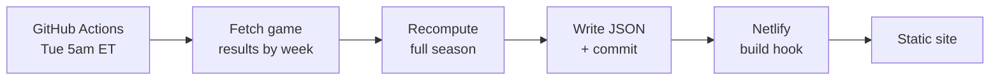

# NFL Wins Pool — Requirements

Sep 24, 2026 · @Chris

## Overview

A public, read-only site that tracks a season-long NFL wins pool for a fixed group of 10 drafters. Each drafter holds three NFL teams drafted before the season; every regular-season win by one of those teams earns one point. The site recalculates standings automatically each Tuesday morning and publishes a ranked leaderboard plus a week-by-week detail view.

**Goal:** replace manual spreadsheet upkeep with a site that is current by Tuesday breakfast and needs no intervention during the season.

**Users:** the 10 participants (view only) and the commissioner (repo owner). No accounts, no logins, no writes from the browser.

**Participants, 2026 season:** Adam, Csati, Curry, Ginter, Groot, Keegan, Kojak, Marty, Mike, Nevin.

30 of 32 teams are drafted. Cardinals and Dolphins are undrafted and score for nobody.

## Pool rules

One point per regular-season win by a team on a drafter's roster. Highest total at the end of Week 18 wins; the top two finishers are paid.

| Rule | Definition |
| --- | --- |
| Roster size | 3 teams per drafter, fixed at the draft, no trades or waivers |
| Scoring | Win = 1 point, loss = 0, tie = 0 |
| Scope | Regular season only, Weeks 1-18. Playoffs do not score |
| Bye weeks | No handling. A team on bye simply cannot earn a point that week |
| Ranking | Descending total points |
| Money positions | 1st and 2nd place |
| Maximum possible | 51 points per drafter (3 teams x 17 games) |

### Ties

A tie affecting 1st or 2nd place is surfaced, not resolved. Tied drafters display at the same rank with a shared-rank marker, and the site flags when a tie sits on the money line so the group can settle it. No automatic tiebreaker is implemented in v1 (see Open decisions).

### 2026 draft roster

| Drafter | Teams | Pick numbers |
| --- | --- | --- |
| Adam | Rams, Giants, Panthers | 1, 20, 26 |
| Csati | Bears, Jaguars, Raiders | 7, 11, 28 |
| Curry | Eagles, Vikings, Steelers | 6, 19, 22 |
| Ginter | Ravens, Bucs, Falcons | 4, 18, 25 |
| Groot | Texans, Cowboys, Commanders | 9, 14, 23 |
| Keegan | Patriots, Chiefs, Colts | 8, 17, 21 |
| Kojak | Seahawks, Chargers, Titans | 2, 16, 29 |
| Marty | 49ers, Bengals, Saints | 10, 12, 24 |
| Mike | Bills, Packers, Jets | 3, 13, 30 |
| Nevin | Lions, Broncos, Browns | 5, 15, 27 |

## Architecture

Static site, static data, no database and no runtime. A GitHub Actions job runs weekly, writes JSON into the repo, commits, and Netlify rebuilds on the push.



### Why static JSON in the repo

The entire season is roughly 180 numbers that change once a week and that no user ever writes to. That makes a database the wrong tool.

- **Free and zero-maintenance.** No instance to keep alive over an 18-week season.
- **Git history is the audit trail.** Every Tuesday's commit is a diff. When someone disputes a total in Week 12, the answer is a commit, not a query.
- **Recoverable.** A bad run is reverted with `git revert`.
- **No cold starts.** The page is a file on a CDN.

The cost is that a manual correction requires a commit rather than a cell edit. For 10 drafters over 18 weeks that is an acceptable trade.

### Alternatives considered

| Option | Why not |
| --- | --- |
| Supabase | Familiar, but a Postgres instance for \~180 read-only numbers is overhead with no payoff. Adds an auth surface and a second dashboard for nothing |
| Netlify Scheduled Functions + Blobs | Keeps one platform, but cron runs in UTC and needs DST handling, Blobs has no version history, and it adds a runtime dependency to data that changes weekly |
| Google Sheets as the live backend | The sheet is the origin of the draft, but depending on link-sharing staying on for 18 weeks is a fragile foundation |

### Stack

| Layer | Choice |
| --- | --- |
| Site | Astro, static output |
| Chart | Hand-rolled CSS/SVG bars, no charting library |
| Scheduler | GitHub Actions cron |
| Job runtime | Node, single script, no framework |
| Host | Netlify, deploy on push to `main` |

Astro is the recommendation because it ships zero JavaScript by default and reads local JSON at build time with no plumbing. Any static generator works; the data contract below is what matters.

## Data source

Pull **game results per week**, not cumulative standings. This is the single most important decision in the job design.

Standings give a running total. To derive "points earned in Week 7" from standings you have to diff this week's snapshot against last week's stored snapshot, which means the Details tab depends on an unbroken chain of successful runs. One missed Tuesday, one double-fire, one corrected result upstream, and every subsequent week is wrong with no way to detect it.

Game results are week-addressable and immutable once final. Every run refetches all played weeks and recomputes the season from zero. A missed week self-heals on the next run.

### Primary: ESPN scoreboard

```
GET https://site.api.espn.com/apis/site/v2/sports/football/nfl/scoreboard
    ?dates=2026&seasontype=2&week=<1-18>
```

No API key, no auth, JSON. Verified working against the 2026 season on 2026-09-24. Fields the job needs:

| Field | Use |
| --- | --- |
| `events[].week.number` | Week attribution |
| `events[].competitions[].competitors[].team.abbreviation` | Team key, e.g. `SEA`, `TB`, `SF` |
| `competitors[].winner` | Boolean. True on exactly one competitor, or false on both for a tie |
| `events[].status.type.completed` | Only count games where this is true |
| `leagues[].calendar` | Week start and end dates, so the job derives the current week rather than hardcoding a schedule |

This is an undocumented endpoint. It is widely used and stable, but it carries no uptime guarantee — hence the fallback.

### Fallback: nflverse

[nflverse-data](https://github.com/nflverse/nflverse-data) publishes season schedule and results as CSV via GitHub releases. Slower to update after a game, but it is versioned, public, and unlikely to disappear. The job tries ESPN first and falls back on a non-200 or malformed response.

### Team key mapping

The sheet uses informal nicknames. ESPN returns full names and abbreviations. **Join on ESPN's `abbreviation`, never on display name** — nicknames are where this breaks.

The mismatch already exists: the sheet says `Bucs`, ESPN says `Buccaneers`. `rosters.json` stores the ESPN abbreviation as the key and the sheet nickname only as a display label.

| Sheet | ESPN abbreviation |
| --- | --- |
| Bucs | TB |
| 49ers | SF |
| Commanders | WSH |
| Jets | NYJ |
| Giants | NYG |
| Raiders | LV |
| Rams | LAR |
| Chargers | LAC |

The remaining 22 map unambiguously. The job fails loudly if any roster key does not match a team in the fetched results — a silent zero is worse than a failed build.

## Data model

Three files. One is hand-maintained, two are generated and never edited by hand.

### `data/rosters.json` — hand-maintained, changes once per season

```json
{
  "season": 2026,
  "drafters": [
    { "name": "Curry", "teams": ["PHI", "MIN", "PIT"] },
    { "name": "Csati", "teams": ["CHI", "JAX", "LV"] }
  ]
}
```

### `data/results.json` — generated, the raw fetch

One record per completed game. This is the audit trail: every point on the site traces back to a row here.

```json
{
  "season": 2026,
  "fetchedAt": "2026-09-29T09:02:11Z",
  "lastCompletedWeek": 3,
  "games": [
    { "week": 1, "gameId": "401872656", "winner": "SEA", "loser": "NE", "tie": false },
    { "week": 1, "gameId": "401872657", "winner": "SF",  "loser": "LAR", "tie": false }
  ]
}
```

`winner` is null when `tie` is true.

### `data/standings.json` — generated, what the pages render

```json
{
  "season": 2026,
  "updatedAt": "2026-09-29T09:02:14Z",
  "throughWeek": 3,
  "standings": [
    {
      "rank": 1,
      "name": "Csati",
      "total": 7,
      "inTheMoney": true,
      "tied": false,
      "byWeek": [3, 2, 2],
      "teams": [
        { "abbr": "CHI", "label": "Bears", "wins": 3 },
        { "abbr": "JAX", "label": "Jaguars", "wins": 2 },
        { "abbr": "LV", "label": "Raiders", "wins": 2 }
      ]
    }
  ]
}
```

`byWeek` is index-aligned to weeks 1..n, so the Details tab is a direct render with no client-side math. `rank` uses competition ranking: two drafters tied at 7 are both rank 1 and the next is rank 3.

## Weekly job

Runs Tuesday \~5am ET, recomputes the full season every time, commits only if the output changed.

### Schedule and DST

GitHub Actions cron is UTC only. 5am ET is 09:00 UTC in EDT and 10:00 UTC in EST, and the season crosses the November change.

Rather than handle the offset, **schedule both and let idempotency absorb the duplicate**:

```yaml
on:
  schedule:
    - cron: '0 9 * * 2'
    - cron: '0 10 * * 2'
  workflow_dispatch:
```

The second run of the day recomputes identical output, the commit step finds no diff, and nothing happens. The cost is one wasted job per week; the benefit is no timezone logic to get wrong in Week 10. `workflow_dispatch` gives a manual re-run button for the week something breaks.

GitHub also delays scheduled jobs under load, so treat 5am as approximate. The requirement is "current before people look on Tuesday," not a precise timestamp.

### Steps

1. Read `rosters.json`, collect the roster team keys.
2. Determine the current week from the ESPN calendar payload.
3. Fetch weeks 1 through current. Keep only games where `status.type.completed` is true.
4. Fail the run if any roster key is missing from the fetched team set.
5. Write `results.json`.
6. Compute per-drafter per-week points and season totals. Rank, mark the top two, flag ties on the money line.
7. Write `standings.json`.
8. Commit both files if changed. No change means no commit and no rebuild.

### Failure behavior

| Condition | Behavior |
| --- | --- |
| ESPN unreachable | Retry 3x with backoff, then fall back to nflverse |
| Both sources fail | Fail the run. Leave the last good JSON in place. Site keeps serving last week's numbers |
| Roster key unmatched | Fail the run before writing anything |
| Partial week, games still to play | Count only completed games. Next run picks up the rest |
| Run missed entirely | No action needed. The next run recomputes everything from Week 1 |

A failed run must be visible. Enable GitHub's workflow-failure email so a silent stall doesn't go three weeks unnoticed.

### Backfill

No special path. The first run fetches Weeks 1 through current and computes the full season, the same as every subsequent run. As of 2026-09-24 the league is in Week 3, so the first run backfills Weeks 1 and 2.

## Main page — standings

One screen, no scrolling on desktop, readable on a phone. Ten horizontal bars ordered top to bottom, longest first.

```
RANK  DRAFTER              POINTS
 1 $  Csati      ████████████  7
 2 $  Curry      ██████████    6
 3    Marty      ████████      5
 4    Mike       ████████      5
 5    Keegan     ██████        4
...
```

### Requirements

| # | Requirement |
| --- | --- |
| M1 | Horizontal bars, left to right, sorted by total points descending |
| M2 | Bar length proportional to points, scaled to the current leader |
| M3 | Drafter name and numeric total always visible, never encoded in bar length alone |
| M4 | Ranks 1 and 2 carry a `$` marker and a distinct bar treatment |
| M5 | Tied drafters share a rank number |
| M6 | When a tie spans the 2nd/3rd boundary, every drafter in that tie gets the `$` marker and the page shows a one-line note that the money position is unresolved |
| M7 | "Through Week N, updated \<date>" visible on the page |
| M8 | Each drafter's three teams and their individual win counts shown, inline or on hover/tap |
| M9 | Readable at 375px wide |
| M10 | Zero points renders a visible stub bar, not an empty row |

### Notes on the money marker

M6 is the case worth getting right. If three drafters tie at 2nd, showing `$` on only one of them is actively wrong and will start an argument. Mark all of them and say so.

Until the season ends the `$` means "currently in the money," not "has won." Label it that way — a small legend line, not a trophy.

## Details tab

A table: one row per drafter, one column per completed week, plus a total.

| Drafter | W1 | W2 | W3 | Total |
| --- | --- | --- | --- | --- |
| Csati | 3 | 2 | 2 | 7 |
| Curry | 3 | 1 | 2 | 6 |
| Marty | 2 | 2 | 1 | 5 |

### Requirements

| # | Requirement |
| --- | --- |
| D1 | Row per drafter, sorted to match the main page |
| D2 | Column per completed week, ascending from W1. Future weeks not shown |
| D3 | Weekly value is points earned that week, not a running total |
| D4 | Total column matches the main page exactly |
| D5 | Horizontal scroll on narrow screens with the drafter name column pinned |
| D6 | A zero week renders `0`, never blank |

D5 is the one that bites. By Week 18 this is a 20-column table, and most people will open it on a phone. Pin the name column or the table becomes unusable around Week 8.

D6 matters because a blank cell is ambiguous between "scored nothing" and "data missing." Always print the number.

## Deployment

Netlify, building from `main`, no environment variables and no secrets.

| Item | Value |
| --- | --- |
| Trigger | Push to `main` — the weekly commit is the deploy |
| Build | `npm run build` |
| Publish dir | `dist` |
| Auth | None. Anyone with the URL can view |
| Custom domain | Optional. A Netlify subdomain is adequate for 10 people |
| Runtime services | None. No functions, no edge handlers, no env vars |

The site holds ten first names and win counts, so a public URL is the right call — a password would add friction for no protection worth having. Share the link once; it stays current on its own.

### Repo layout

```
/data
  rosters.json        hand-maintained
  results.json        generated
  standings.json      generated
/scripts
  update-standings.js
/src                  Astro pages
.github/workflows/weekly.yml
```

## Open decisions

| # | Question | Needed by |
| --- | --- | --- |
| O1 | Tiebreaker rule for the money positions. v1 flags ties instead of resolving them | Before Week 18 |
| O2 | Payout amounts. Not currently modeled anywhere. Should the site display them? | Whenever |
| O3 | Rescheduled games that land outside their nominal week. Rare, but the job attributes by ESPN's `week.number`, which may not match intuition | Only if it happens |

### Out of scope for v1

- Playoff scoring
- Historical seasons or year-over-year comparison
- Any interactivity: filters, sorting, projections
- Notifications when standings change
- Mid-season roster changes
- Live in-game updates

### Risks

| Risk | Mitigation |
| --- | --- |
| ESPN endpoint changes or disappears mid-season | nflverse fallback; full recompute means a fix is one re-run |
| Silent job failure | Workflow-failure email; the site shows its "through Week N" stamp so staleness is visible to everyone |
| Nickname mismatch mis-scores a team | Join on abbreviation; hard fail on any unmatched roster key |
| GitHub Actions cron delay | Requirement is "before people look Tuesday," not a timestamp; `workflow_dispatch` for manual runs |

## Sources

- [ESPN NFL scoreboard endpoint](https://site.api.espn.com/apis/site/v2/sports/football/nfl/scoreboard?dates=2026&seasontype=2&week=1) — verified 2026-09-24
- [nflverse-data](https://github.com/nflverse/nflverse-data) — fallback results source
- Draft roster: the 2026 tab of the pool's Google Sheet
